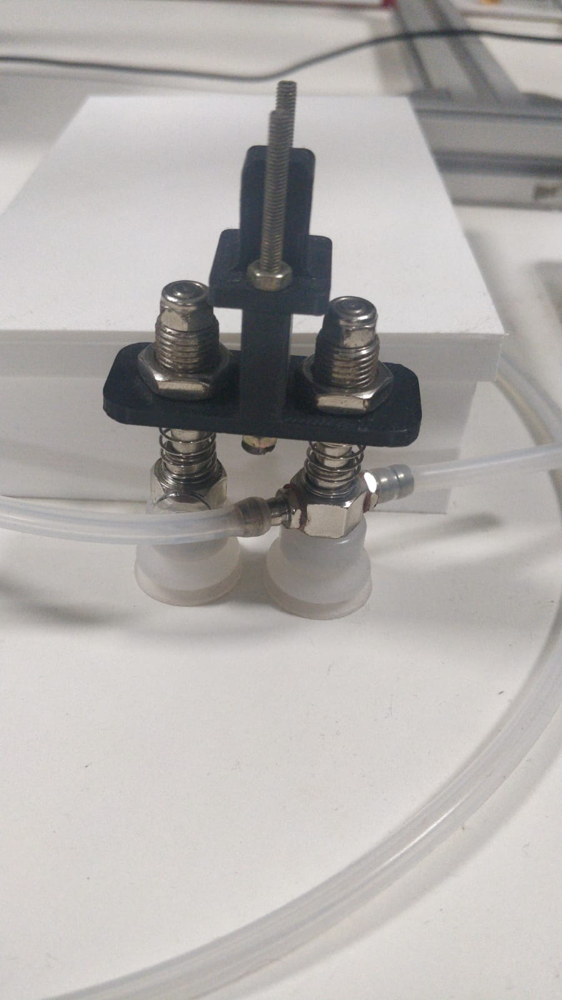
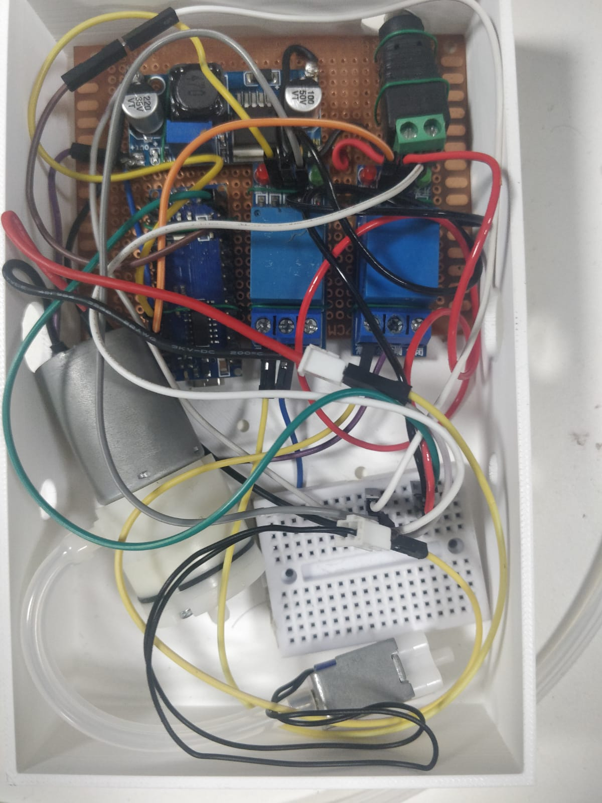

# 🤖 myCobot Vacuum Pick-and-Place

A pick-and-place robotic system using an **Elephant Robotics myCobot** equipped with a **vacuum suction pump end-effector**. The cobot performs automated object pickup and placement using suction-based gripping.

<div align="center">

</div>

---

## Overview

This project demonstrates a vacuum-based robotic manipulation system using an Elephant Robotics myCobot.

The robot uses a vacuum pump to securely grasp lightweight objects and transport them between predefined locations.

---

## Features

- 🤖 Elephant Robotics myCobot control
- 🧲 Vacuum suction end-effector
- 📦 Automated pick-and-place
- 🎯 Cartesian coordinate control
- ⚡ Configurable pick and drop positions
- 🔄 Vacuum ON/OFF control
- 🐍 Python implementation

---

## Hardware

- Elephant Robotics myCobot
- Vacuum Pump
- Vacuum Suction Cup
- Relay / Pump Driver
- Raspberry Pi
- USB Connection

<div align="center">

</div>

---

## Software

- Python
- pymycobot
- NumPy

<div align="center">

</div>

<br></br>

<div align="center">

</div>


---


## Workflow

```text
Move Above Object
        │
        ▼
Move Down
        │
        ▼
Vacuum ON
        │
        ▼
Lift Object
        │
        ▼
Move to Destination
        │
        ▼
Move Down
        │
        ▼
Vacuum OFF
        │
        ▼
Return Home
```

---

## Running the Project

The robot performs the following sequence:

1. Move above the object
2. Descend to the pickup position
3. Activate the vacuum pump
4. Lift the object
5. Move to the destination
6. Descend to the placement position
7. Deactivate the vacuum pump
8. Return to the home position

---


## Future Improvements

- Camera-guided object detection
- Automatic object localization
- Conveyor belt integration
- Multi-object pick-and-place
- ROS2 integration
- Motion planning and obstacle avoidance

---

## Author

**Pulkit Garg**
Contributions made by Yenepoya University students Abin Thomas & Misthah.

---